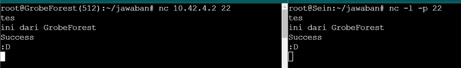

# Jarkom-Modul-5-E11-2023

Laporan resmi praktikum Jaringan Komputer modul 5 kelompok E11

| Nama                       | NRP        |
| -------------------------- | ---------- |
| Sarah Nurhasna Khairunnisa | 5025211105 |
| Tsabita Putri Ramadhany    | 5025211130 |

# Daftar Isi

- [SOAL](#soal)
- [JAWABAN](#jawaban)
  - [Setup A-D](#setup-a-d)
  - [NO 1](#no-1)
  - [NO 2](#no-2)
  - [NO 3](#no-3)
  - [NO 4](#no-4)
  - [NO 5](#no-5)
  - [NO 6](#no-6)
  - [NO 7](#no-7)
  - [NO 8](#no-8)
  - [NO 9](#no-9)
  - [NO 10](#no-10)
- [KENDALA](#kendala)

# Soal

Setelah pandai mengatur jalur-jalur khusus, kalian diminta untuk membantu North Area menjaga wilayah mereka dan kalian dengan senang hati membantunya karena ini merupakan tugas terakhir.

(A) Tugas pertama, buatlah peta wilayah sesuai berikut ini:


Keterangan:

- Richter adalah DNS Server
- Revolte adalah DHCP Server
- Sein dan Stark adalah Web Server
- Jumlah Host pada SchwerMountain adalah 64
- Jumlah Host pada LaubHills adalah 255
- Jumlah Host pada TurkRegion adalah 1022
- Jumlah Host pada GrobeForest adalah 512

(B) Untuk menghitung rute-rute yang diperlukan, gunakan perhitungan dengan metode VLSM. Buat juga pohonnya, dan lingkari subnet yang dilewati.

(C) Kemudian buatlah rute sesuai dengan pembagian IP yang kalian lakukan.

(D) Tugas berikutnya adalah memberikan ip pada subnet SchwerMountain, LaubHills, TurkRegion, dan GrobeForest menggunakan bantuan DHCP.

Soal:

1. Agar topologi yang kalian buat dapat mengakses keluar, kalian diminta untuk mengkonfigurasi Aura menggunakan iptables, tetapi tidak ingin menggunakan MASQUERADE.
2. Kalian diminta untuk melakukan drop semua TCP dan UDP kecuali port 8080 pada TCP.
3. Kepala Suku North Area meminta kalian untuk membatasi DHCP dan DNS Server hanya dapat dilakukan ping oleh maksimal 3 device secara bersamaan, selebihnya akan di drop.
4. Lakukan pembatasan sehingga koneksi SSH pada Web Server hanya dapat dilakukan oleh masyarakat yang berada pada GrobeForest.
5. Selain itu, akses menuju WebServer hanya diperbolehkan saat jam kerja yaitu Senin-Jumat pada pukul 08.00-16.00.
6. Lalu, karena ternyata terdapat beberapa waktu di mana network administrator dari WebServer tidak bisa stand by, sehingga perlu ditambahkan rule bahwa akses pada hari Senin - Kamis pada jam 12.00 - 13.00 dilarang (istirahat maksi cuy) dan akses di hari Jumat pada jam 11.00 - 13.00 juga dilarang (maklum, Jumatan rek).

7. Karena terdapat 2 WebServer, kalian diminta agar setiap client yang mengakses Sein dengan Port 80 akan didistribusikan secara bergantian pada Sein dan Stark secara berurutan dan request dari client yang mengakses Stark dengan port 443 akan didistribusikan secara bergantian pada Sein dan Stark secara berurutan.

8. Karena berbeda koalisi politik, maka subnet dengan masyarakat yang berada pada Revolte dilarang keras mengakses WebServer hingga masa pencoblosan pemilu kepala suku 2024 berakhir. Masa pemilu (hingga pemungutan dan penghitungan suara selesai) kepala suku bersamaan dengan masa pemilu Presiden dan Wakil Presiden Indonesia 2024.

9. Sadar akan adanya potensial saling serang antar kubu politik, maka WebServer harus dapat secara otomatis memblokir alamat IP yang melakukan scanning port dalam jumlah banyak (maksimal 20 scan port) di dalam selang waktu 10 menit.
   (clue: test dengan nmap)

10. Karena kepala suku ingin tau paket apa saja yang di-drop, maka di setiap node server dan router ditambahkan logging paket yang di-drop dengan standard syslog level.

# Jawaban

## Setup A-D

1.  Buat topologinya terlebih dahulu di GNS3 dan tentukan subnetnya, berikut merupakan pembagian subnet kelompok kami:
    

2.  Tentukan netmask setiap subnetnya berdasarkan jumlah IP yang dibutuhkan.
    

3.  Lakukan pembagian IP subnet dengan menggunakan metode VLSM, berikut merupakan tree VLSM dan hasil pembagian IP beserta hasil perhitungan IP broadcastnya.

    - Tree VSLM
      

    - Pembagian IP
      

4.  Lakukan konfigurasi IP di setiap node sesuai dengan pembagian IP yang ada.

    - AURA

      ```bash
      # AURA
      auto eth0
      iface eth0 inet dhcp
      hwaddress ether 3a:4c:af:92:6f:3b

      #A1 --> 10.42.1.0 - 10.42.1.3
      auto eth1
      iface eth1 inet static
      address 10.42.1.1
      netmask 255.255.255.252

      #A4 --> 10.42.1.4 - 10.42.1.7
      auto eth2
      iface eth2 inet static
      address 10.42.1.5
      netmask 255.255.255.252
      ```

      Node `AURA` merupakan node yang tersambung ke NAT dan langsung mendapatkan internet dari NAT, IP yang didapat berasal dari DHCP. Akan tetapi, untuk kebutuhan di nomor 1 `AURA` membutuhkan IP yang fix, maka:

      a. Start node `AURA` dan cek IP yang didapat dari DHCP dengan perintah `ip a`.

      b. Kemudian copy hwadressnya dan simpan di configurasi IP `AURA`:

      ```bash
      auto eth0
      iface eth0 inet dhcp
      hwaddress ether 3a:4c:af:92:6f:3b
      ```

    - HEITER

      ```bash
      #A1 --> 10.42.1.0 - 10.42.1.3
      auto eth0
      iface eth0 inet static
      address 10.42.1.2
      netmask 255.255.255.252
      gateway 10.42.1.1

      #A2 --> 10.42.8.0 - 10.42.15.255
      auto eth1
      iface eth1 inet static
      address 10.42.8.1
      netmask 255.255.248.0

      #A3 --> 10.42.4.0 - 10.42.7.255
      auto eth2
      iface eth2 inet static
      address 10.42.4.1
      netmask 255.255.252.0
      ```

    - SEIN

      ```bash
      auto eth0
      iface eth0 inet static
      address 10.42.4.2
      netmask 255.255.255.252
      gateway 10.42.4.1
      ```

    - FRIEREN

      ```bash
      #A4 --> 10.42.1.4 - 10.42.1.7
      auto eth0
      iface eth0 inet static
      address 10.42.1.6
      netmask 255.255.255.252
      gateway 10.42.1.5

      #A5 --> 10.42.1.8 - 10.42.1.11
      auto eth1
      iface eth1 inet static
      address 10.42.1.9
      netmask 255.255.255.252

      #A6 --> 10.42.1.12 - 10.42.1.15
      auto eth2
      iface eth2 inet static
      address 10.42.1.13
      netmask 255.255.255.252
      ```

    - STARK

      ```bash
      #A5 --> 10.42.1.8 - 10.42.1.11
      auto eth0
      iface eth0 inet static
      address 10.42.1.10
      netmask 255.255.255.252
      gateway 10.42.1.9
      ```

    - HIMMEL

      ```bash
      #A6 --> 10.42.1.12 - 10.42.1.15
      auto eth0
      iface eth0 inet static
      address 10.42.1.14
      netmask 255.255.255.252
      gateway 10.42.1.13

      #A7 --> 10.42.2.0 - 10.42.3.255
      auto eth1
      iface eth1 inet static
      address 10.42.2.1
      netmask 255.255.254.0

      #A8 --> 10.42.1.128 - 10.42.1.255
      auto eth2
      iface eth2 inet static
      address 10.42.1.129
      netmask 255.255.255.128
      ```

    - FERN

      ```bash
      #A8 --> 10.42.1.128 - 10.42.1.255
      auto eth0
      iface eth0 inet static
      address 10.42.1.130
      netmask 255.255.255.128
      gateway 10.42.1.129

      #A9 --> 10.42.1.16 - 10.42.1.19
      auto eth1
      iface eth1 inet static
      address 10.42.1.17
      netmask 255.255.255.252

      #A10 --> 10.42.1.20 - 10.42.1.23
      auto eth2
      iface eth2 inet static
      address 10.42.1.21
      netmask 255.255.255.252
      ```

    - RICHTER

      ```bash
      #A9 --> 10.42.1.16 - 10.42.1.19
      auto eth0
      iface eth0 inet static
      address 10.42.1.18
      netmask 255.255.255.252
      gateway 10.42.1.17
      ```

    - REVOLTE

      ```bash
      #A10 --> 10.42.1.20 - 10.42.1.23
      auto eth0
      iface eth0 inet static
      address 10.42.1.22
      netmask 255.255.255.252
      gateway 10.42.1.21
      ```

    - TURK REGION

      ```bash
      auto eth0
      iface eth0 inet dhcp
      gateway 10.42.8.1
      ```

    - GROBE FOREST

      ```bash
      auto eth0
      iface eth0 inet dhcp
      gateway 10.42.4.1
      ```

    - LAUB HILLS

      ```bash
      auto eth0
      iface eth0 inet dhcp
      gateway 10.42.2.1
      ```

    - SCHWER MOUNTAIN
      ```bash
      auto eth0
      iface eth0 inet dhcp
      gateway 10.42.1.129
      ```

5.  Lakukan routing pada masing-masing router

    - HEITER (Default routing)

      ```bash
      # HEITER --> eth1 aura
      up route add -net 0.0.0.0 netmask 0.0.0.0 gw 10.42.1.1
      ```

    - FERN (Default routing)

      ```bash
      # FERN --> eth0 Himmel
      up route add -net 0.0.0.0 netmask 0.0.0.0 gw 10.42.1.14
      ```

    - HIMMEL

      ```bash
      # A9 (Fern-Richter) - eth0 fern
      up route add -net 10.42.1.16 netmask 255.255.255.252 gw 10.42.1.130
      # A10 (Fern-revolte) - eth0 fern
      up route add -net 10.42.1.20 netmask 255.255.255.252 gw 10.42.1.130
      ```

    - FRIEREN

      ```bash
      # A7 (himmel-laubHils) - eth0 himmel
      up route add -net 10.42.2.0 netmask 255.255.254.0 gw 10.42.1.14
      # A8 (himmel-schwerMountain-fern) - eth0 himmel
      up route add -net 10.42.1.128 netmask 255.255.255.128 gw 10.42.1.14
      # A9 (fern-richter) - eth0 himmel
      up route add -net 10.42.1.16 netmask 255.255.255.252 gw 10.42.1.14
      # A10 (fern-revolte) - eth0 himmel
      up route add -net 10.42.1.20 netmask 255.255.255.252 gw 10.42.1.14
      ```

    - AURA

      ```bash
      # aura-heiter
      # A2 (heiter-turkRegion) - eth0 heiter
      up route add -net 10.42.8.0 netmask 255.255.248.0 gw 10.42.1.2
      # A3 (heiter-sein-grobeForest) - eth0 heiter
      up route add -net 10.42.4.0 netmask 255.255.252.0 gw 10.42.1.2

      # aura-frieren
      # A5 (frieren-stark) - eth0 frieren
      up route add -net 10.42.1.8 netmask 255.255.255.252 gw 10.42.1.6
      # A6 (frieren-himmel) - eth0 frieren
      up route add -net 10.42.1.12 netmask 255.255.255.252 gw 10.42.1.6
      # A7 (himmel-laubHills) - eth0 frieren
      up route add -net 10.42.2.0 netmask 255.255.254.0 gw 10.42.1.6
      # A8 (himmel-schewerMountain-fern) - eth0 frieren
      up route add -net 10.42.1.128 netmask 255.255.255.128 gw 10.42.1.6
      # A9 (fern-Richter) - eth0 frieren
      up route add -net 10.42.1.16 netmask 255.255.255.252 gw 10.42.1.6
      # A10 (fern-revolte) - eth0 frieren
      up route add -net 10.42.1.20 netmask 255.255.255.252 gw 10.42.1.6
      ```

6.  Buat iptables di `AURA` yaitu dengan script berikut dan restart node `AURA`:

    ```bash
    iptables -t nat -A POSTROUTING -o eth0 -j SNAT --to-source 192.168.122.225
    ```

    Iptables ini sekaligus merupakan jawaban untuk `nomor 1`.

7.  Lakukan setup DNS server di node `RICHTER` dengan script berikut.

    ```bash
    # Richter
    echo 'nameserver 192.168.122.1' >/etc/resolv.conf

    apt update
    apt install netcat -y
    apt install bind9 -y

    echo '
    options {
      directory "/var/cache/bind";
      forwarders {
        192.168.122.1;
      };
      allow-query {any;};
      auth-nxdomain no; # conform to RFC1035
      listen-on-v6 {any;};
    };' > /etc/bind/named.conf.options

    service bind9 restart
    ```

8.  Selanjutnya lakukan setup DHCP server di node `REVOLTE` dengan script berikut.

    ```bash
    echo 'nameserver 192.168.122.1' > /etc/resolv.conf
    # atau simpan di bashrc REVOLTE (DHCP SERVER)
    apt update
    apt install netcat -y
    apt install isc-dhcp-server -y
    # dhcpd --version

    # tentukan interface
    echo '
    INTERFACESv4="eth0"
    ' > /etc/default/isc-dhcp-server

    echo '
        # A1 aura eth1
        subnet 10.42.1.0 netmask 255.255.255.252 {
        }

        # A2 heiter eth1
        subnet 10.42.8.0 netmask 255.255.248.0 {
            range 10.42.8.2 10.42.15.254; # A2 TurkRegion
            option routers 10.42.8.1; # IP heiter eth1
            option broadcast-address 10.42.15.255;
            option domain-name-servers 10.42.1.18; # IP RICHTER DNS SERVER
            default-lease-time 600;
            max-lease-time 7200;
        }

        # A3 heiter eth2
        subnet 10.42.4.0 netmask 255.255.252.0 {
            range 10.42.4.3 10.42.7.254; # A3 GrobeForest
            option routers 10.42.4.1; # IP heiter eth2
            option broadcast-address 10.42.7.255;
            option domain-name-servers 10.42.1.18; # IP RICHTER DNS SERVER
            default-lease-time 600;
            max-lease-time 7200;
        }

        # A4 aura eth2
        subnet 10.42.1.4 netmask 255.255.255.252 {
        }

        # A5 frieren eth1
        subnet 10.42.1.8 netmask 255.255.255.252 {
        }

        # A6 frieren eth2
        subnet 10.42.1.12 netmask 255.255.255.252 {
        }

        # A7 himmel eth1
        subnet 10.42.2.0 netmask 255.255.254.0 {
            range 10.42.2.2 10.42.3.254; # A7 LaubHills
            option routers 10.42.2.1; # IP himmel eth1
            option broadcast-address 10.42.3.255;
            option domain-name-servers 10.42.1.18; # IP RICHTER DNS SERVER
            default-lease-time 600;
            max-lease-time 7200;
        }

        # A8 himmel eth2
        subnet 10.42.1.128 netmask 255.255.255.128 {
            range 10.42.1.131 10.42.1.254; # A8 SchewerMountain
            option routers 10.42.1.129; # IP himmel eth2
            option broadcast-address 10.42.1.255;
            option domain-name-servers 10.42.1.18; # IP RICHTER DNS SERVER
            default-lease-time 600;
            max-lease-time 7200;
        }

        # A9 fern eth1
        subnet 10.42.1.16 netmask 255.255.255.252 {
        }

        # A10 fern eth2
        subnet 10.42.1.20 netmask 255.255.255.252 {
        }
    ' > /etc/dhcp/dhcpd.conf

    service isc-dhcp-server restart
    service isc-dhcp-server status
    ```

9.  Client akan mendapatkan IP dari DHCP Server, maka kita perlu melakukan setup DHCP Relay terlebih dahulu pada router yang berada dekat dengan client yaitu pada node `HEITER` dan `HIMMEL`.

    - Script :

      ```bash
      # DI HEITER DAN HIMMEL

      echo 'nameserver 192.168.122.1' > /etc/resolv.conf
      # atau simpan di bashrc
      apt-get update
      apt-get install isc-dhcp-relay -y

      echo -e '
          SERVERS="10.42.1.22"  #IP REVOLTE DHCP SERVER
          INTERFACES="eth0 eth1 eth2"
          OPTIONS=""
      ' > /etc/default/isc-dhcp-relay

      # konfigurasi IP forwarding
      echo '
          net.ipv4.ip_forward=1
      ' > /etc/sysctl.conf

      service isc-dhcp-relay restart
      ```

10. Setup Web-server di node `SEIN` dan `STARK` dengan script berikut.

    ```bash
    # DI SEIN & STARK

    echo 'nameserver 192.168.122.1' > /etc/resolv.conf

    apt update
    apt install netcat -y
    apt install apache2 -y
    service apache2 start

    echo '
    Listen 80
    Listen 443

    <IfModule ssl_module>
            Listen 443
    </IfModule>

    <IfModule mod_gnutls.c>
            Listen 443
    </IfModule>
    ' > /etc/apache2/ports.conf

    # untuk testing
    # echo '
    # # Sein | Stark
    # Ini Sein | Ini Stark
    # ' > /var/www/html/index.html

    service apache2 restart
    ```

## NO 1

> Agar topologi yang kalian buat dapat mengakses keluar, kalian diminta untuk mengkonfigurasi Aura menggunakan iptables, tetapi tidak ingin menggunakan MASQUERADE.

Untuk nomor 1 sudah dilakukan di bagian setup dan dapat disimpan di `/root/.bashrc`.

```bash
iptables -t nat -A POSTROUTING -o eth0 -j SNAT --to-source 192.168.122.225
```

**Testing**

- Restart Client yaitu `TurkRegion`, `GrobeForest`, `SchewerMountain`, `LaubHills`.

- Lakukan testing di client dengan `ip a` dan `ping google.com`

  - TurkRegion
    

  - GrobeForest
    

  - SchewerMountain
    

  - LaubHills
    

## NO 2

> Kalian diminta untuk melakukan drop semua TCP dan UDP kecuali port 8080 pada TCP.

Tambahkan rule iptables berikut pada node `REVOLTE`.

- Untuk menerima packet dari port 8080 dengan TCP
  ```bash
  iptables -A INPUT -p tcp --dport 8080 -j ACCEPT
  ```
- Untuk melakukan drop semua TCP dan UDP
  ```bash
  iptables -A INPUT -p tcp -j DROP
  iptables -A INPUT -p udp -j DROP
  ```

**Testing**

Untuk melakukan testing di client perlu melakukan download netcat dengan:

```bash
echo 'nameserver 192.168.122.1' > /etc/resolv.conf
apt-get update
apt install netcat -y
```

- TCP port 8080
  

- UDP port 8080
  

- TCP port 9090
  

## NO 3

> Kepala Suku North Area meminta kalian untuk membatasi DHCP dan DNS Server hanya dapat dilakukan ping oleh maksimal 3 device secara bersamaan, selebihnya akan di drop.

Tambahkan rule iptables berikut pada node `REVOLTE`.

- Untuk memberikan batasan koneksi

  ```bash
  iptables -I INPUT -p icmp -m connlimit --connlimit-above 3 --connlimit-mask 0 -j DROP
  ```

- Untuk menerima paket yang terkait dengan koneksi yang sudah terbentuk (ESTABLISHED) atau koneksi yang telah terikat (RELATED)

  ```bash
  iptables -I INPUT -m state --state ESTABLISHED,RELATED -j ACCEPT
  ```

**Hasil iptables**


**Testing**

Testing dilakukan di semua client dan lakukan ping ke IP `REVOLTE`


## NO 4

> Lakukan pembatasan sehingga koneksi SSH pada Web Server hanya dapat dilakukan oleh masyarakat yang berada pada GrobeForest.

Tambahkan rules iptables berikut di Web Server yaitu node `SEIN` dan `STARK`:

- Untuk menerima packet dari GrobeForest dengan koneksi SSH

  ```bash
  iptables -A INPUT -p tcp --dport 22 -s 10.42.4.0/22 -j ACCEPT
  ```

  Karena IP GrobeForest berubah-ubah dari range `10.42.4.1 - 10.42.7.255`, maka gunakan IP dari subnet A3 (Heiter-Switch3-Sein-Switch3-GrobeForest) agar semua IP yang berada di subnet A3 diterima oleh Web Server.

- Untuk menolak packet selain dari GrobeForest
  ```bash
  iptables -A INPUT -p tcp --dport 22 -j DROP
  ```

**Hasil iptables**


**Testing**

- GrobeForest

  

- Client selain GrobeForest --> ex: SchwerMountain

  

## NO 5

> Selain itu, akses menuju WebServer hanya diperbolehkan saat jam kerja yaitu Senin-Jumat pada pukul 08.00-16.00.

Untuk menambahkan ketentuan waktu pada soal, kita dapat memperbarui iptables pada nomor sebelumnya dengan syntax berikut:

```bash
iptables -R INPUT 1 -p tcp --dport 22 -s 10.42.4.0/22 -m time --timestart 08:00 --timestop 16:00 --weekdays Mon,Tue,Wed,Thu,Fri -j ACCEPT
```

**Penjelasan**:

- `-R INPUT 1` untuk mengganti rule pada indeks pertama dengan rule yang baru
- Untuk mengecek indeks rule yang ingin diganti dapat menggunakan syntax berikut.

  ```bash
  iptables -L INPUT --line-numbers
  ```

- `-m time --timestart 08:00 --timestop 16:00 --weekdays Mon,Tue,Wed,Thu,Fri` untuk menentukan rentang waktu dan hari di mana aturan ini berlaku. Aturan ini membatasi akses pada hari Senin sampai Jumat dari pukul 08:00 hingga 16:00.

**Hasil iptables**


**Testing**

- Sesuai rentang waktu yang dapat diakses

  Set date agar sesuai dengan rentang waktu yang dapat diakses dengan menggunakan syntax berikut:

  ```bash
  date --set="2023-12-15 10:00:00"
  ```

  - GrobeForest

    

  - Client selain GrobeForest

    

- Diluar rentang waktu yang dapat diakses

  Set date agar diluar rentang waktu yang dapat diakses dengan menggunakan syntax berikut:

  ```bash
  date --set="2023-12-15 22:00:00"
  ```

  - GrobeForest

    

  - Client selain GrobeForest

    

## NO 6

> Lalu, karena ternyata terdapat beberapa waktu di mana network administrator dari WebServer tidak bisa stand by, sehingga perlu ditambahkan rule bahwa akses pada hari Senin - Kamis pada jam 12.00 - 13.00 dilarang (istirahat maksi cuy) dan akses di hari Jumat pada jam 11.00 - 13.00 juga dilarang (maklum, Jumatan rek).

Tambahkan rules iptables berikut di Web Server yaitu node `SEIN` dan `STARK`:

- Rule agar akses pada hari Senin - Kamis pada jam 12.00 - 13.00 dilarang.

  ```bash
  iptables -I INPUT 1 -p tcp --dport 22 -s 10.42.4.0/22 -m time --timestart 12:00 --timestop 13:00 --weekdays Mon,Tue,Wed,Thu -j DROP
  ```

  Simpan rules di index pertama agar dijalankan sebelum rules yang menerima semua packet di hari Senin sampai Jumat dari pukul 08:00 hingga 16:00 dengan menggunakan `-I INPUT 1` yang artinya sisipkan rule ke index pertama.

- Rule agar akses di hari Jumat pada jam 11.00 - 13.00 dilarang.
  ```bash
  iptables -I INPUT 2 -p tcp --dport 22 -s 10.42.4.0/22 -m time --timestart 11:00 --timestop 13:00 --weekdays Fri -j DROP
  ```
  Simpan rules di index kedua agar dijalankan sebelum rules yang menerima semua packet di hari Jumat pada jam 11.00 - 13.00 dengan menggunakan `-I INPUT 2` yang artinya sisipkan rule ke index ke-2.

**Hasil iptables**


**Testing**

- Sesuai rentang waktu yang dapat diakses

  Set date agar sesuai dengan rentang waktu yang dapat diakses dengan menggunakan syntax berikut:

  ```bash
  date --set="2023-12-15 10:00:00"
  ```

  - GrobeForest

    

  - Client selain GrobeForest

    

- Diluar rentang waktu yang dapat diakses

  - Grobe Forest

    - Senin sampai Jumat dari pukul 08:00 hingga 16:00
      Set date dengan menggunakan syntax berikut:

      ```bash
      date --set="2023-12-11 12:00:00"
      ```

      

    - Jumat pada jam 11.00 - 13.00

      Set date dengan menggunakan syntax berikut:

      ```bash
      date --set="2023-12-15 12:00:00"
      ```

      

  - Client selain GrobeForest

    - Senin sampai Jumat dari pukul 08:00 hingga 16:00
      Set date dengan menggunakan syntax berikut:

      ```bash
      date --set="2023-12-11 12:00:00"
      ```

      

    - Jumat pada jam 11.00 - 13.00

      Set date dengan menggunakan syntax berikut:

      ```bash
      date --set="2023-12-15 12:00:00"
      ```

      

## NO 7

## NO 8

## NO 9

## NO 10

# Kendala
